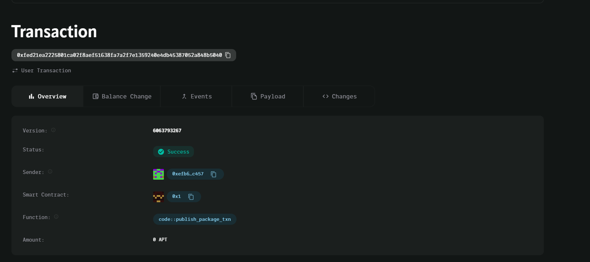

### Deployed smartcontract address: 0xfed21ea2225801ca02f8aef51638fa7a2f7e1359240e4db45387052a848b5040

### Screenshot:

# Decentralized Freelancer Payment System

## Project Title
Decentralized Freelancer Payment System

## Project Description
A decentralized platform that connects freelancers with clients, facilitating secure payments via smart contracts. Payments are locked in the smart contract and are released once the freelancer completes the task.

## Vision
To provide a decentralized, trustless platform for freelance work, ensuring fair and on-time payment for completed tasks, using blockchain technology to automate and secure transactions.

## Key Features
- Secure payment contracts between clients and freelancers.
- On-time payment release upon task completion.
- Simple and transparent workflow for both parties.

## Future Scope
- Integration with milestone-based payments.
- Escrow services for dispute resolution.
- Multi-currency support for global freelancers.
